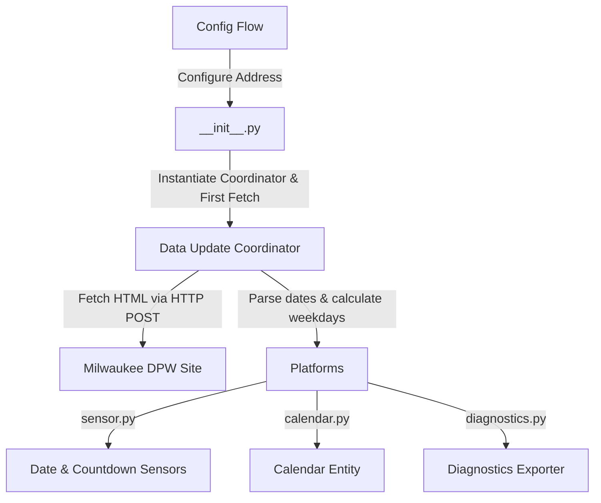

# Milwaukee Garbage and Recycling Integration for Home Assistant

Home Assistant custom integration to scrape and display the upcoming garbage and recycling pickup dates for addresses in the City of Milwaukee, WI.

This integration uses the official City of Milwaukee Department of Public Works (DPW) address-based lookup service.

---

## Architecture

This integration follows modern Home Assistant standards and patterns:



1. **Config Flow (`config_flow.py`)**: 
   Provides a clean user interface to enter the street number, direction, name, and suffix. Suffixes are optional.
   
2. **Integration Lifecycle (`__init__.py`)**: 
   Instantiates the `DataUpdateCoordinator`, performs the first data fetch synchronously on load to ensure entities are populated immediately, and stores the coordinator in `entry.runtime_data` (Home Assistant 2024.4+ standard).
   
3. **Data Update Coordinator (`coordinator.py`)**: 
   Manages fetching data from the Milwaukee DPW website via asynchronous HTTP POST requests using the `aiohttp` client. It uses a flexible regex parser to extract date strings for garbage, recycling, and Clean & Green pickups. It dynamically calculates the next calendar date for weekday-only schedules.
   
4. **Sensor Platform (`sensor.py`)**: 
   Instantiates date sensors and days-until countdown sensors:
   - `sensor.garbage_pickup` & `sensor.garbage_pickup_days`
   - `sensor.recycling_pickup` & `sensor.recycling_pickup_days`
   - `sensor.clean_and_green_pickup` & `sensor.clean_and_green_pickup_days`

5. **Calendar Platform (`calendar.py`)**:
   Exposes a calendar entity (`calendar.collection_calendar`) displaying upcoming pickups as all-day events on your Home Assistant dashboard calendar.

6. **Diagnostics Platform (`diagnostics.py`)**:
   Allows secure download of anonymized configuration and state diagnostics via the Home Assistant UI.

7. **HACS Configuration (`hacs.json`)**:
   Declares HACS compatibility metadata for easy custom repository installation.

---

## Version Control & Release Tracking

This integration is tracked and version-controlled via Git. Versions follow [Semantic Versioning (SemVer)](https://semver.org/):

* **Current Stable Version**: `1.1.0` (Added Clean & Green, Days-Until sensors, Home Assistant Calendar integration, Diagnostics exporter, and HACS configuration).
* **Previous Versions**:
  - `1.0.2` (Modernized to `entry.runtime_data`, flexible scrapers, custom translation files, and optional suffix fields).
  - `1.0.1` (Legacy layout utilizing outdated coordinator setups and strict date scrapers).

Version status can be checked in [manifest.json](custom_components/mke_garbage_recycling/manifest.json) under the `"version"` key.

---

## Installation & Setup

1. Copy the `mke_garbage_recycling` folder into your Home Assistant `custom_components` directory.
2. Restart Home Assistant.
3. In Home Assistant, go to **Settings** -> **Devices & Services** -> **Add Integration**.
4. Search for **Milwaukee Garbage and Recycling** and fill in your address details.

---

## Developer Notes

### Running Verification Tests
A mock environment verification script is included to test the parsing and scraping logic without requiring a running Home Assistant instance:
```bash
python3 verify_integration.py
```
This script validates date extraction against residential HTML layouts and apartment HTML layouts.
