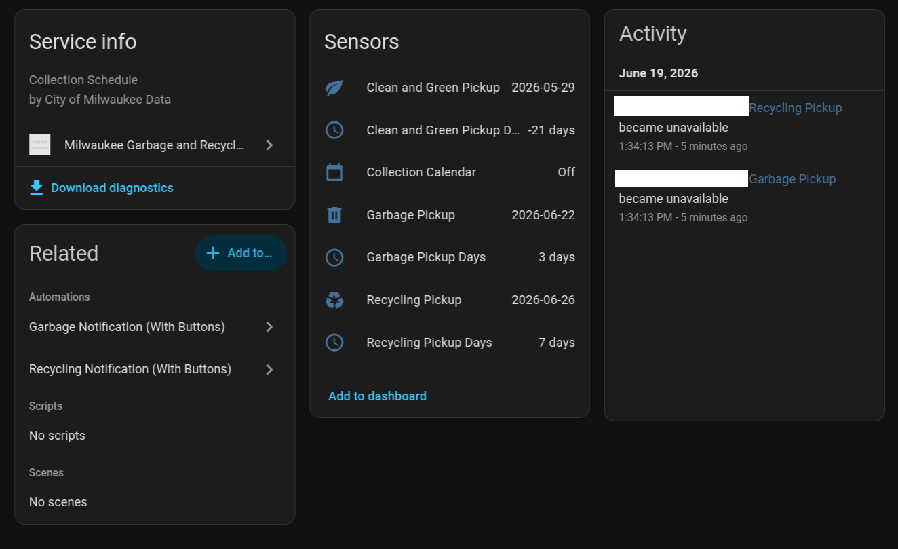
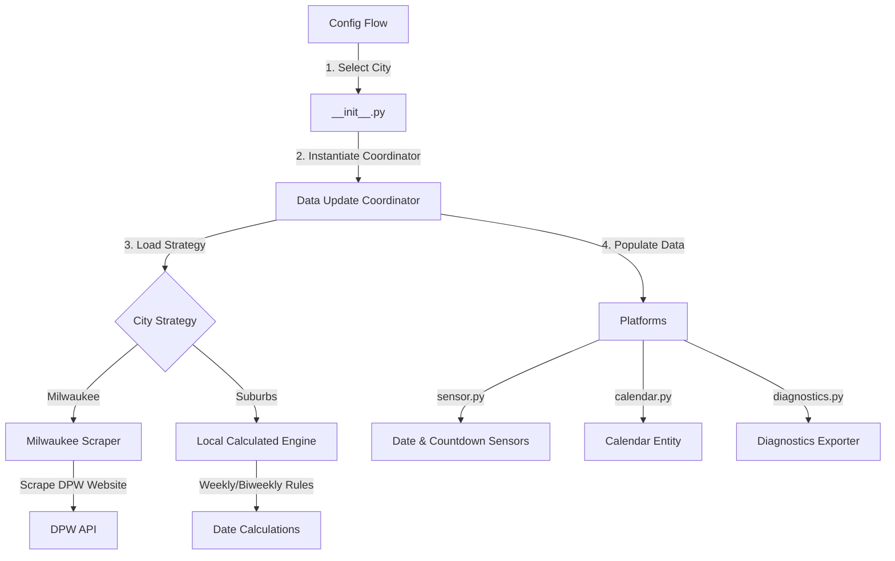
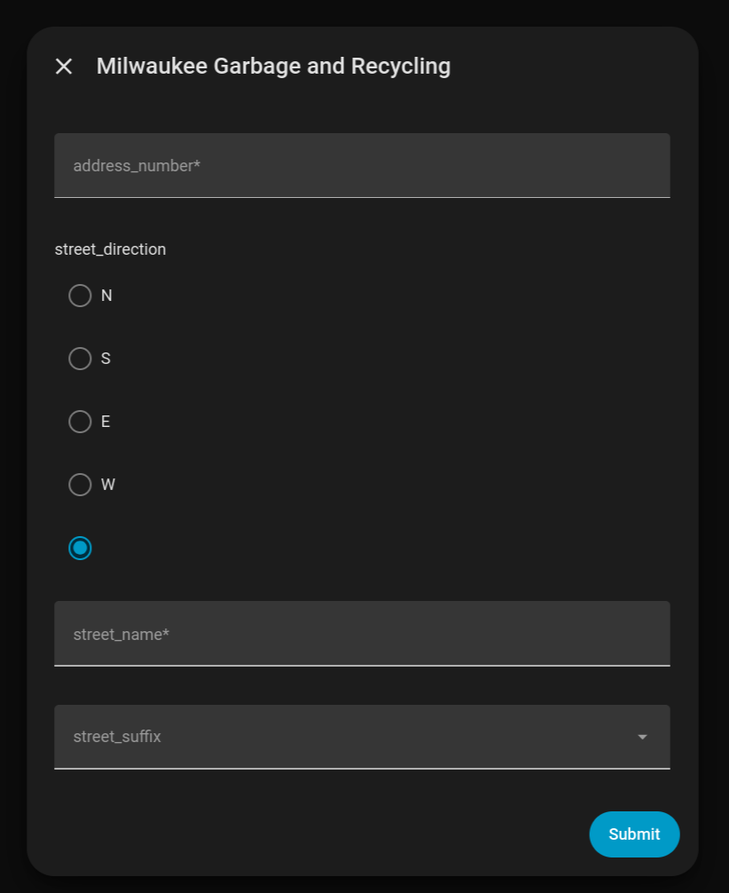

# Milwaukee County Waste Collection Integration for Home Assistant

A modern Home Assistant custom integration to track upcoming garbage, recycling, and Clean & Green collection schedules across **all municipalities in Milwaukee County, WI** (including Milwaukee, West Allis, Wauwatosa, Shorewood, Glendale, Oak Creek, Franklin, and more).

This integration supports both automated address-based lookup (for the City of Milwaukee) and a robust, holiday-aware local calculation engine (for other suburbs).



---

## Architecture & Design

This integration uses a **Strategy / Provider Pattern** to handle different collection schedules across suburbs cleanly:



1. **Config Flow (`config_flow.py`)**: 
   A multi-step configuration wizard. Step 1 asks you to select your municipality. Step 2 presents fields tailored to that city (e.g., street address details for Milwaukee; collection weekday and recycling route/frequency for other suburbs).
   
2. **Strategy Providers (`sources/`)**:
   - **Milwaukee Scraper (`sources/milwaukee.py`)**: Uses asynchronous HTTP POST requests to scrape the official City of Milwaukee DPW address servlet.
   - **Local Calculated Engine (`sources/local_calculated.py`)**: A rule-based scheduler for suburbs. It computes garbage and recycling pickup dates dynamically (weekly or biweekly Route 1/Route 2).
   - **Observed Holiday Shifts**: The calculated engine automatically shifts pickup dates by `+1` day if a major US holiday (New Year's, Memorial Day, Independence Day, Labor Day, Thanksgiving, or Christmas) falls on or before your collection day in the same week (supporting weekend-observed rules).

3. **Sensor Platform (`sensor.py`)**: 
   Instantiates date sensors and days-until countdown sensors:
   - `sensor.garbage_pickup` & `sensor.garbage_pickup_days`
   - `sensor.recycling_pickup` & `sensor.recycling_pickup_days`
   - `sensor.clean_and_green_pickup` & `sensor.clean_and_green_pickup_days`

4. **Calendar Platform (`calendar.py`)**:
   Exposes a calendar entity (`calendar.collection_calendar`) displaying upcoming pickups as all-day events on your Home Assistant dashboard calendar.

---

## Installation & Setup

### Option 1: Install via HACS (Recommended)
1. Open **HACS** in Home Assistant.
2. Click the three dots in the top-right corner and select **Custom repositories**.
3. Add your repository URL: `https://github.com/scetep/mke_garbage_recycling`
4. Choose **Integration** as the category and click **Add**.
5. Find the integration in HACS, download it, and restart Home Assistant.

### Option 2: Manual Installation
1. Copy the `mke_garbage_recycling` folder from `custom_components/` into your Home Assistant `config/custom_components/` directory.
2. Restart Home Assistant.

### Setup Configuration
1. Go to **Settings** -> **Devices & Services** -> **Add Integration**.
   
   

2. Search for **Milwaukee Garbage and Recycling** and select your city.
3. Configure your address details or collection day:

   

---

## Developer Notes

### Running Verification Tests
A mock environment verification script is included in the scratch folder to test the parsing, scraping, and holiday shift logic:
```bash
python3 verify_multi_city.py
```
This script validates date extraction against residential/apartment layouts and asserts that holiday adjustments shift pickup days accurately.
